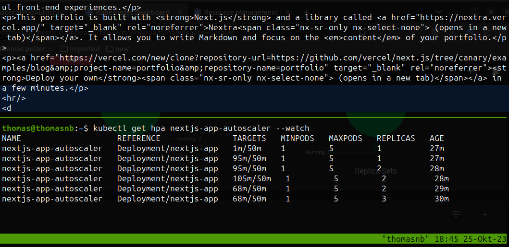

# DevOps Course Exercise 1

This project is a portfolio website for DevOps course exercise 1. The website is built with Next.js and Nextra.

## Workflows

All workflows can be found in the [.github/workflows](.github/workflows) folder.

### Development

On push (for every branch) following steps are triggered

* npm ci
* npm run lint
* npm run build (result of the build is ignored)

### Pull request

Merging to the main branch can only be done with a pull request. Pull request must pass the **Audit** and the **Lint & Build** pipeline.

### Deployment

When a pull request is merged to main the source code is dockerized and pushed
to [Dockerhub](https://hub.docker.com/r/veidl/blog)

# DevOps Course Exercise 2

Deploying the application to a Kubernetes cluster. For testing the cluster was deployed locally using Minikube.

## Horizontal Pod Autoscaler

The application is scaled based on CPU usage. The autoscaler is configured to scale between 1 and 5 replicas.

When running the busy box - it can be seen that the CPU limit is reached and the application is scaled to max 5 replicas.

``kubectl run -i --tty load-generator --rm --image=busybox:1.28 --restart=Never -- /bin/sh -c "while sleep 0.01; do wget -q -O- http://nextjs-app; done"``

The following image shows how the autoscaler worked:

